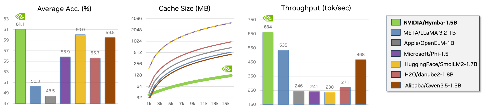

# Hymba


<p align="center">
        🤗 <a href="https://huggingface.co/collections/nvidia/hymba-673c35516c12c4b98b5e845f">Hugging Face Models</a>&nbsp&nbsp | &nbsp&nbsp 📄 <a href="https://arxiv.org/abs/2411.13676">Paper</a> | &nbsp&nbsp 📜 <a href="https://developer.nvidia.com/blog/hymba-hybrid-head-architecture-boosts-small-language-model-performance/">Blog</a> &nbsp
</p>

## Introduction

Hymba is a family of small language models (SLMs) featuring a hybrid-head parallel architecture that integrates transformer attention mechanisms with SSMs to achieve the best of both worlds: enhanced efficiency and improved performance. In Hymba, attention heads provide high-resolution recall, while SSM heads enable efficient context summarization.

## News

1. 🚀 Hymba is out! Check our [blog post](https://developer.nvidia.com/blog/hymba-hybrid-head-architecture-boosts-small-language-model-performance/) and [paper](https://arxiv.org/abs/2411.13676).

## Hymba Model Performance

<p align="center">
  
  <p align="center">Performance comparison of Hymba-1.5B-Base against sub-2B models in terms of average accuracy, cache size (MB) relative to sequence length, and throughput (tok/sec).</p>
</p>

As shown in the above figure, we compare Hymba-1.5B against sub-2B models (LlaMA 3.2-1B, OpenELM-1B, Phi-1.5, SmolLM2-1.7B, danube2-1.8B, Qwen2.5-1.5B) in terms of average task accuracy, cache size (MB) relative to sequence length, and throughput (tok/sec).
In this set of experiments, the tasks include MMLU, ARC-C, ARC-E, PIQA, Hellaswag, Winogrande, and SQuAD-C, and the throughput is measured on an NVIDIA A100 with a sequence length of 8k and a batch size of 128 using PyTorch. 
For models encountering out-of-memory (OOM) issues during throughput measurement, we halve the batch size until the OOM is resolved to measure the maximal achievable throughput without OOM.

## Hugging Face Checkpoints, Model Cards and Usage

Please see:

1. [Hymba-1.5B-Base](https://huggingface.co/nvidia/Hymba-1.5B-Base)
2. [Hymba-1.5B-Instruct](https://huggingface.co/nvidia/Hymba-1.5B-Instruct)

## Model Usage

### Environment Setup

Since our model employs [FlexAttention](https://pytorch.org/blog/flexattention/), which relies on PyTorch 2.5 and other related dependencies, we provide two ways to set up the environment:

- **[Local Install]** Install the related packages using our provided `setup.sh` (support CUDA 12.1/12.4):
```
wget --header="Authorization: Bearer YOUR_HF_TOKEN" https://huggingface.co/nvidia/Hymba-1.5B-Instruct/resolve/main/setup.sh
bash setup.sh
```

- **[Docker]** We have prepared a docker image with all of Hymba's dependencies installed. You can download our docker image and start a container using the following commands:

```
docker pull ghcr.io/tilmto/hymba:v1
docker run --gpus all -v /home/$USER:/home/$USER -it ghcr.io/tilmto/hymba:v1 bash
```

### Chat with Hymba
After setting up the environment, you can use the following script to chat with our model in the command line.

```
python chat.py
```

### Finetuning Hymba


[LMFlow](https://github.com/OptimalScale/LMFlow) is a complete pipeline for fine-tuning large language models. 
The following steps provide an example of how to fine-tune the `Hymba-1.5B-Base` models using LMFlow.

1. Using Docker

    ```
      docker pull ghcr.io/tilmto/hymba:v1
      docker run --gpus all -v /home/$USER:/home/$USER -it ghcr.io/tilmto/hymba:v1 bash
    ```
2. Install LMFlow

    ```
      git clone https://github.com/OptimalScale/LMFlow.git
      cd LMFlow
      conda create -n lmflow python=3.9 -y
      conda activate lmflow
      conda install mpi4py
      pip install -e .
    ```

3. Fine-tune the model using the following command.
  
    ```
      cd LMFlow
      bash ./scripts/run_finetune_hymba.sh
    ```

With LMFlow, you can also fine-tune the model on your custom dataset. The only thing you need to do is transform your dataset into the [LMFlow data format](https://optimalscale.github.io/LMFlow/examples/DATASETS.html).
In addition to full-finetuniing, you can also fine-tune hymba efficiently with [DoRA](https://arxiv.org/html/2402.09353v4), [LoRA](https://github.com/OptimalScale/LMFlow?tab=readme-ov-file#lora), [LISA](https://github.com/OptimalScale/LMFlow?tab=readme-ov-file#lisa), [Flash Attention](https://github.com/OptimalScale/LMFlow/blob/main/readme/flash_attn2.md), and other acceleration techniques.
For more details, please refer to the [LMFlow for Hymba](https://github.com/OptimalScale/LMFlow/tree/main/experimental/Hymba) documentation.

## Evaluation
We use LM Evaluation Harness to evaluate the model. The evaluation commands are as follows:

```bash
git clone --depth 1 https://github.com/EleutherAI/lm-evaluation-harness
git fetch --all --tags
git checkout tags/v0.4.4  # squad completion task is not compatible with the latest version
cd lm-evaluation-harness
pip install -e .

lm_eval --model hf --model_args pretrained=nvidia/Hymba-1.5B-Base,dtype=bfloat16,trust_remote_code=True \
     --tasks mmlu \
     --num_fewshot 5 \
     --batch_size 1 \
     --output_path ./hymba_HF_base_lm-results \
     --log_samples 

lm_eval --model hf --model_args pretrained=nvidia/Hymba-1.5B-Base,dtype=bfloat16,trust_remote_code=True \
     --tasks arc_easy,arc_challenge,piqa,winogrande,hellaswag \
     --num_fewshot 0 \
     --batch_size 1 \
     --output_path ./hymba_HF_base_lm-results \
     --log_samples 

lm_eval --model hf --model_args pretrained=nvidia/Hymba-1.5B-Base,dtype=bfloat16,trust_remote_code=True \
     --tasks squad_completion \
     --num_fewshot 1 \
     --batch_size 1 \
     --output_path ./hymba_HF_base_lm-results \
     --log_samples
```


## License

Hymba models are released under the [NVIDIA Open Model License Agreement](https://developer.download.nvidia.com/licenses/nvidia-open-model-license-agreement-june-2024.pdf).


## Trouble Shooting
**[Caution] During generation, the batch size needs to be 1. Our current implementation does not fully support padding of Meta tokens + SWA; this is a work in progress. Training and pre-filling support any batch size.**

For other questions, please refer to the [Trouble Shooting](https://github.com/NVlabs/hymba/blob/main/TROUBLESHOOTING.md) page and feel free to submit an issue for help.

## Citation

If you find our work helpful, please consider citing our [paper](https://arxiv.org/abs/2411.13676):
```
@article{hymba2024,
      title={Hymba: A Hybrid-head Architecture for Small Language Models}, 
      author={Xin Dong and Yonggan Fu and Shizhe Diao and Wonmin Byeon and Zijia Chen and Ameya Sunil Mahabaleshwarkar and Shih-Yang Liu and Matthijs Van Keirsbilck and Min-Hung Chen and Yoshi Suhara and Yingyan Lin and Jan Kautz and Pavlo Molchanov},
      year={2024},
      eprint={2411.13676},
      archivePrefix={arXiv},
      primaryClass={cs.CL},
      url={https://arxiv.org/abs/2411.13676}, 
}
```
